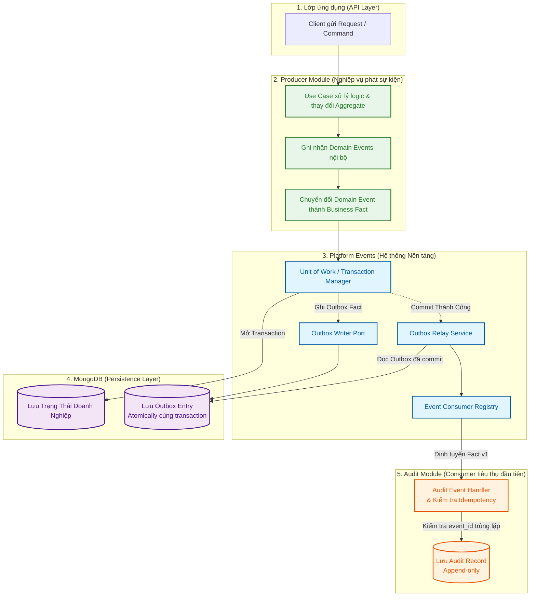

```mermaid
flowchart TD
    %% Định nghĩa màu sắc cho các nhóm trách nhiệm
    classDef platform fill:#e1f5fe,stroke:#01579b,stroke-width:2px,color:#01579b;
    classDef producer fill:#e8f5e9,stroke:#2e7d32,stroke-width:2px,color:#2e7d32;
    classDef audit fill:#fff3e0,stroke:#e65100,stroke-width:2px,color:#e65100;
    classDef db fill:#f3e5f5,stroke:#4a148c,stroke-width:2px,color:#4a148c;

    subgraph Client["1. Lớp ứng dụng (API Layer)"]
        A[Client gửi Request / Command]
    end

    subgraph Producer["2. Producer Module (Nghiệp vụ phát sự kiện)"]
        B[Use Case xử lý logic & thay đổi Aggregate]
        C[Ghi nhận Domain Events nội bộ]
        D[Chuyển đổi Domain Event thành Business Fact]
    end

    subgraph Platform["3. Platform Events (Hệ thống Nền tảng)"]
        H[Unit of Work / Transaction Manager]
        I[Outbox Writer Port]
        J[Outbox Relay Service]
        K[Event Consumer Registry]
    end

    subgraph DB["4. MongoDB (Persistence Layer)"]
        E[(Lưu Trạng Thái Doanh Nghiệp)]
        F[(Lưu Outbox Entry\nAtomically cùng transaction)]
    end

    subgraph Audit["5. Audit Module (Consumer tiêu thụ đầu tiên)"]
        L[Audit Event Handler\n& Kiểm tra Idempotency]
        M[(Lưu Audit Record\nAppend-only)]
    end

    %% Luồng xử lý
    A --> B
    B --> C --> D

    %% Giao dịch nguyên tử (Atomic Unit of Work)
    D --> H
    H -->|Mở Transaction| E
    H -->|Ghi Outbox Fact| I
    I --> F

    %% Cam kết giao dịch thành công
    H -.->|Commit Thành Công| J

    %% Quá trình Relay và Dispatch sự kiện
    J -->|Đọc Outbox đã commit| F
    J --> K
    K -->|Định tuyến Fact v1| L

    %% Xử lý Consumer & Audit
    L -->|Kiểm tra event_id trùng lặp| M

    %% Gán Style màu sắc
    class A client;
    class B,C,D producer;
    class H,I,J,K platform;
    class E,F db;
    class L,M audit;
```
